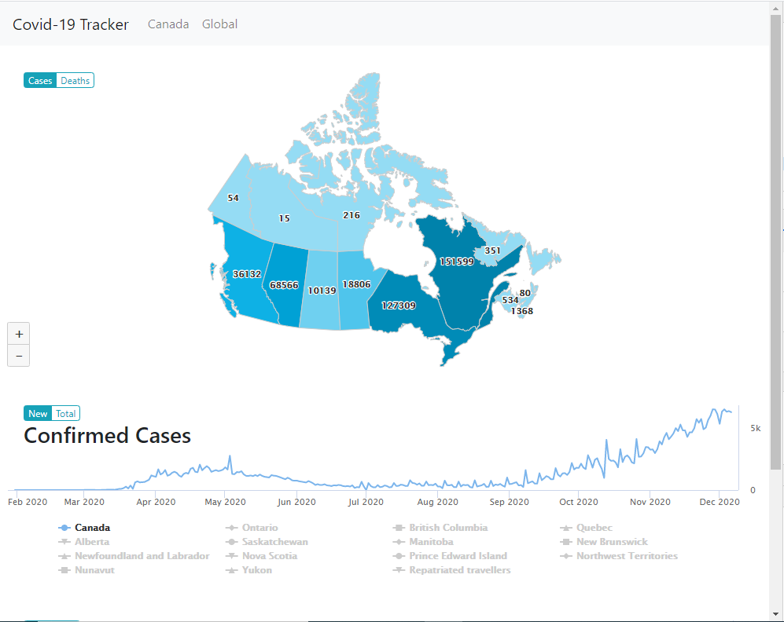
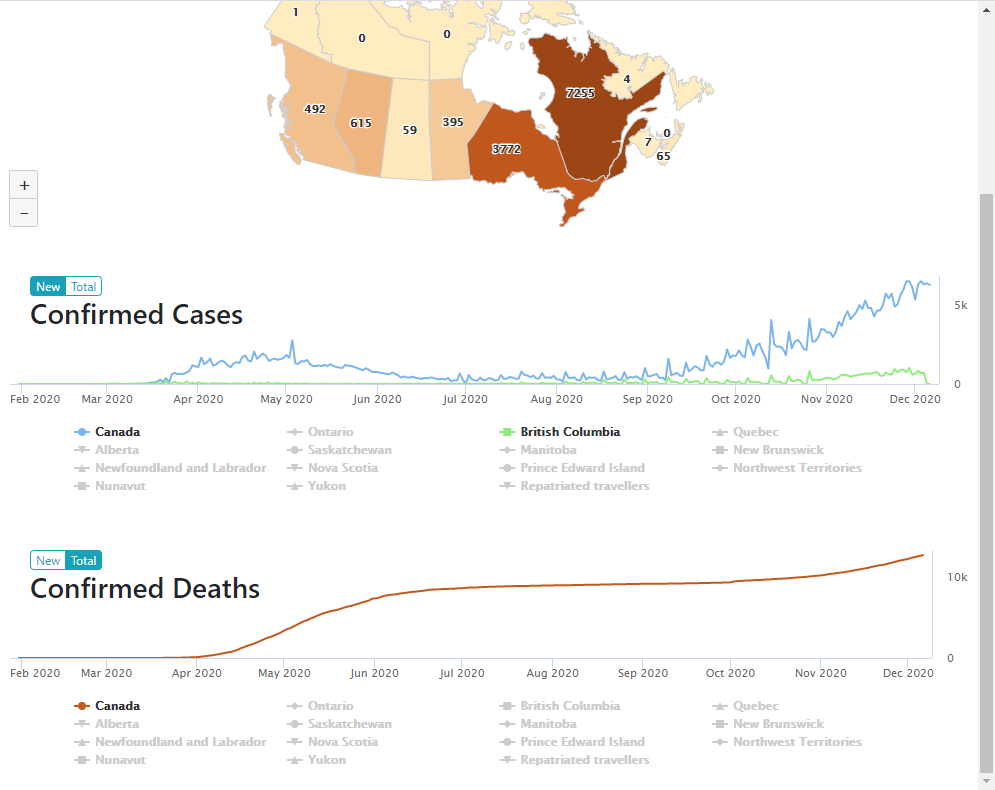
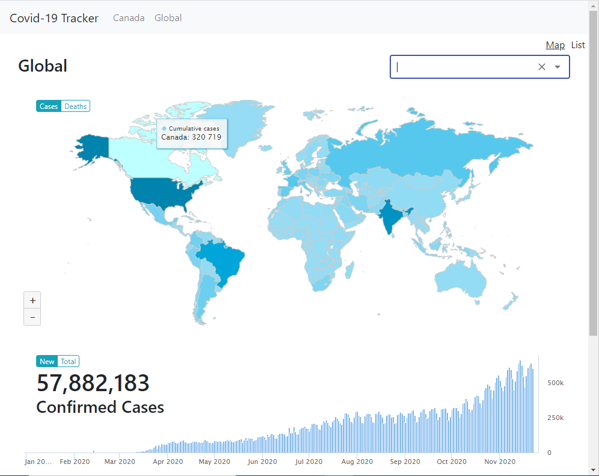
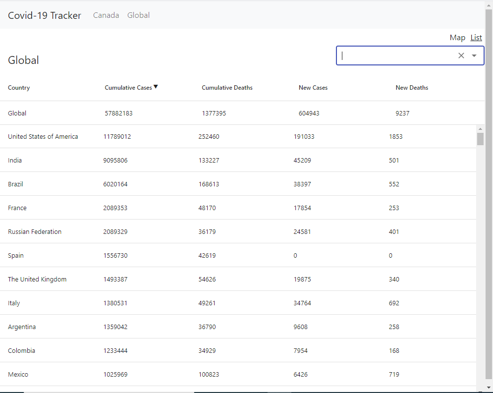

# Covid-19 Tracker

This project is a track app that allows people to track the cases of covid 19

## Technologies Used

This is a MERN Project

React.js is used to create the frontend app

Nodejs and Express.js are used to set up the backend server

MongoDB and Mongo Altas are used to create a database

## Deployment

Client is deployed on Netlify.com

Server is deployed on Heroku.com

Cloud Database is deployed on Mongo Altas

## Demo

Have a try on this link: https://distracted-banach-1c98f6.netlify.app/
Followings are some picture of the project

### Map and Chart View of the Covid-19 Cases in Canada

### Map and Chart View of the Covid-19 Cases Worldwide

